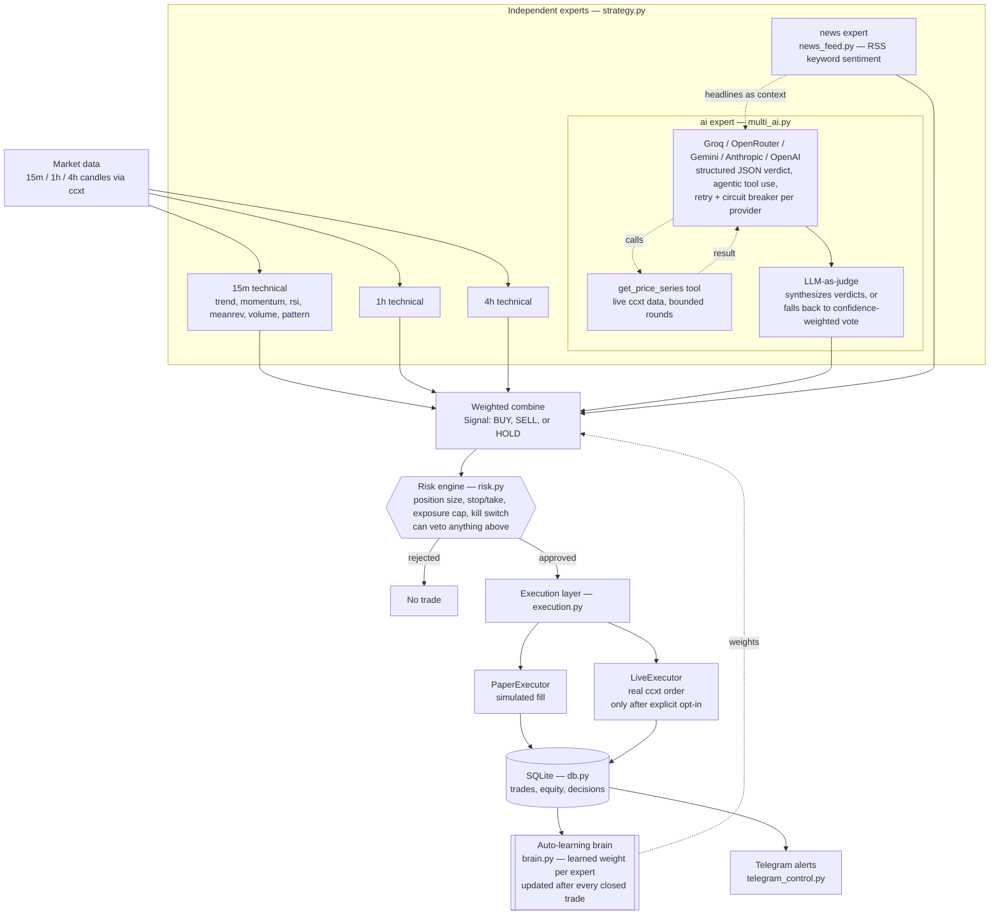

# ZORA Advanced Pocket Trader (Termux edition)

[](https://github.com/YOUR_USERNAME/zora_advanced_bot/actions/workflows/ci.yml)
[](LICENSE)
[](pyproject.toml)

A multi-timeframe, multi-factor, multi-symbol crypto trading bot designed to
run on a phone via Termux. Paper trading by default — no real money moves
unless you deliberately unlock the `live` command.

*(the CI badge above will go green once you push this to your own repo — see
[Git](#git) below; it's inert until then)*

## Contents

- [What's new in 0.9.2](#whats-new-in-092)
- [What's new in 0.8.0](#whats-new-in-080)
- [What's new in 0.7.0](#whats-new-in-070)
- [What's "advanced" about this version](#whats-advanced-about-this-version)
- [Architecture](#architecture)
- [Setup (Termux)](#setup-termux)
- [Usage](#usage)
- [Telegram (optional)](#telegram-optional)
- [Going live](#going-live)
- [Development & testing](#development--testing)
- [Please read before you trust any of this with real money](#please-read-before-you-trust-any-of-this-with-real-money)
- [Git](#git)

## What's new in 0.9.2

An audit-and-hardening release; the full list is in `CHANGELOG.md`. Headlines: the ML expert had a look-ahead leak
(fixed), `bot.py` now really implements every command documented below, native stop/take-profit pairs are cleaned up
correctly, `validate` warns when an edge disappears under higher costs, and packaging/CI files that were missing now exist.

## What's new in 0.7.0

**Bugs fixed** (see `CHANGELOG.md` for the full list): restarts no longer reset equity/drawdown or crash when
closing a restored position; news matching no longer fires on `together`/`bank`/`again`; a failed close no longer
leaves a live position without its stop; HTX market buys now carry a price; the Gemini key no longer leaks into
logs/Telegram; the backtester now uses candle highs/lows and resets its daily-loss baseline; `AI_MIN_CONFIDENCE`
and `AI_CYCLE_MIN_SECONDS` actually work; `costs.py` is now packaged; CI lint passes.

**New** (picked from the feature-gap analysis, the ones that are safe to build and test without an exchange):

| Feature | Where | Notes |
|---|---|---|
| Backtest metrics (win rate, profit factor, expectancy, max DD, Sharpe, Sortino) | `metrics.py`, `bot.py metrics`, `/metrics` | one engine for backtest, learn, validate |
| Walk-forward parameter search | `optimize.py`, `bot.py optimize` | train 70% / test 30%; never searches risk limits; suggests, never edits `.env` |
| Trailing stop + breakeven | `risk.manage_stop` | paper / software-protected positions only |
| Stale-data guard | `guards.is_stale` | skips a cycle on frozen feeds |
| Market-quality gate (spread + 24h volume) | `guards.market_quality` | live entries |
| Strategy-degradation guard (rolling profit factor) | `guards.strategy_degraded` | pauses entries after a full window of poor trades |
| BTC/ETH correlation regime | `guards.rolling_correlation` | decorrelated -> entries sized x0.5 (soft guard) |
| Fear & Greed expert | `fear_greed.py` | contrarian, free API, learned by the brain as `fng` |
| Read-only web dashboard | `dashboard.py`, `bot.py dashboard` | stdlib only, localhost, no trading controls |
| `doctor` command | `bot.py doctor` | offline config/db/brain check |
| Paginated history fetch | `data.fetch_ohlcv_history` | 2000-candle validation really uses 2000 candles |

## What's new in 0.8.0

Added from the competitor feature-gap analysis (Freqtrade / 3Commas / OctoBot / Bitsgap / Cryptohopper). Still
**no new pip dependency** — everything is stdlib + numpy/pandas, so it installs on Termux.

| Feature | Where | Notes |
|---|---|---|
| DCA cycles | `dca.py`, `python bot.py dca [SYMBOL] [CANDLES]` | fixed-size buys, capped safety orders, hard stop, take-profit; compared against buy & hold. **Never martingale.** Historical simulation only |
| Spot grid | `grid.py`, `python bot.py grid [SYMBOL] [CANDLES]` | fixed capital slice, sells-before-buys fill order, **floor stop** that liquidates and halts. Historical simulation only |
| ML expert | `ml_model.py` (`ML_ENABLED`) | numpy logistic regression, walk-forward; outputs 0 unless it beats `ML_MIN_HOLDOUT_ACCURACY` on held-out data. One vote the brain weighs as `ml` |
| TradingView webhook | `tv_signal.py` + dashboard `/webhook/tradingview` | off unless `TV_WEBHOOK_SECRET` is set; constant-time secret check, size + rate limits; alert **expires** (`TV_SIGNAL_TTL_MINUTES`) and is just one `tv` vote |

DCA and grid are simulators, not live order managers: both place and track many exchange-side orders, which
cannot be proven safe without a real exchange, and this project keeps real-money code to what it can test.
Run them on history to see how they compare with the trend-following core before deciding anything.

**TradingView alert body** (point the alert's webhook URL at your tunnel/reverse proxy -> `/webhook/tradingview`,
and put TLS in front of it; the dashboard speaks plain HTTP):

```json
{"secret": "<TV_WEBHOOK_SECRET>", "action": "buy", "confidence": 70, "note": "RSI cross"}
```

**Still not built, on purpose:** copy trading and portfolio rebalancing (ETH-only by design), reinforcement-learning
position sizing, AI-controlled risk limits, martingale/unlimited averaging (all listed as anti-features in the
analysis). **Not built, needs keys/services:** whale/on-chain alerts (Etherscan/Whale Alert key) and X/Reddit
sentiment (paid/approved API access) — easy to add as another expert once you have keys.

## What's "advanced" about this version

- **Multi-timeframe ensemble**: scores 15m / 1h / 4h independently, weights
  higher timeframes more, then combines them — so a short-term blip can't
  override a bigger trend.
- **Multi-factor scoring**: EMA trend stack, MACD momentum, RSI, Bollinger
  mean-reversion, volume confirmation, and classic chart pattern recognition
  (see below), combined transparently instead of a single opaque "AI says
  buy" black box.
- **Chart pattern recognition** (`patterns.py`): candlestick patterns
  (engulfing, hammer/hanging man, shooting star, doji, morning/evening
  star) and swing-based patterns (double top/bottom, head & shoulders and
  its inverse, support/resistance breakouts with volume confirmation) —
  all read straight off the same OHLCV candles the technical experts
  already use, no extra API calls. Confirmed vs. merely-possible patterns
  score differently (e.g. a double top only scores heavily once price
  actually breaks the trough between the two peaks), and detected pattern
  names are logged whenever one fires, not just silently folded into a
  number. Triangles, wedges, and flags are a deliberate scope line — they
  need trendline fitting to detect reliably, which is a lot more code for
  the most subjective patterns to begin with. This becomes the "pattern"
  factor, learned by the brain exactly like every other factor here.
- **Independent risk engine**: position sizing from ATR volatility + a fixed
  risk-per-trade percentage, plus hard kill switches for daily loss and
  drawdown, and a real exposure cap shared across every symbol you trade.
  The risk engine can veto any signal; no signal, AI opinion, or learned
  weight can override it.
- **Multi-AI expert panel** (`multi_ai.py`) — four things that separate this
  from "ask five chatbots and average the votes":
  1. **Structured output**, not regex-parsed prose: every provider is asked
     for a JSON verdict via its own native mechanism (Anthropic forced
     tool-calling, OpenAI/Groq `json_object` mode, Gemini `responseSchema`),
     with a legacy text-format parser as a last-resort fallback so an
     uncooperative model degrades gracefully instead of crashing the cycle.
  2. **Agentic tool use**: Anthropic and the OpenAI-compatible providers
     (Groq, OpenRouter, OpenAI) can call a real `get_price_series` tool
     against live market data before answering, bounded to a couple of
     rounds so it can't stall the trading loop. (Gemini's function-calling
     wire format differs enough that it gets structured JSON only, not the
     agentic loop — a deliberate, documented scope line.)
  3. **LLM-as-judge**: when 2+ providers answer, their individual verdicts
     go to one judge provider (`AI_JUDGE_PROVIDER`, or whichever answered)
     to weigh and synthesize into one final call, instead of just averaging
     votes. If the judge is unavailable, this falls back to
     confidence-weighted vote averaging automatically.
  4. **Resilience**: one immediate retry on a transient error, then a
     circuit breaker — a provider that keeps failing gets a cooldown so a
     dead/rate-limited endpoint isn't hammered every poll cycle, and a
     real `Retry-After` header sets that cooldown precisely when given.

  Groq, OpenRouter, and Gemini all have a genuine no-card free tier as of
  this writing, plus optional paid Anthropic/OpenAI. Every provider is
  queried in parallel once per symbol per cycle; the synthesized result
  becomes the **"ai" expert** below.
- **News/sentiment feed** (`news_feed.py`): pulls recent headlines from
  public RSS feeds (CoinDesk, CoinTelegraph — no API key, no quota to run
  out of), keyword-scores them for the coin you're trading, and becomes the
  **"news" expert**. The same matched headlines are also handed to the AI
  panel as context, so an LLM opinion is grounded in an actual recent
  headline instead of guessing blind.
- **Auto-learning brain** (`brain.py`): after every closed trade (paper,
  `learn`, or live), it nudges how much the strategy trusts each of the five
  experts (15m / 1h / 4h / ai / news) and each technical factor, based on
  whether leaning on them actually paid off. Simple, inspectable
  "multiplicative weights" online learning — no heavy ML dependencies,
  weights saved to human-readable `brain_state.json`. It only changes which
  *signal* gets generated; it never touches position sizing or the kill
  switches, which stay fixed in `risk.py` regardless of what the brain or
  any expert has said.
- **Multi-symbol portfolio mode**: `SYMBOLS` in `.env` trades several coins
  at once from one shared equity pool — `MAX_EXPOSURE_PCT` caps total risk
  across all of them combined, not per-symbol.
- **Telegram alerts + remote control** (`telegram_control.py`, both
  optional): trade alerts pushed to your phone, plus `/status /pause
  /resume /kill /brain` commands you can send from anywhere — including a
  kill switch that works even if the Termux session itself is unreachable.
- **Real live-order execution** (`execution.py`): when explicitly unlocked
  (see below), places actual orders via ccxt — precision/minimum-size
  checked, a client order ID for idempotency, and a retry only on pure
  network errors, never on an ambiguous or rejected response. Still gated
  by the exact same risk engine as paper mode.
- **Structured logging** (`logging_setup.py`): console + rotating log file
  (size-capped, so it won't slowly eat phone storage), configurable via
  `LOG_LEVEL`/`LOG_FILE` in `.env`.
- **SQLite logging**: every decision (approved or rejected) and every trade,
  across every symbol, so you can audit what happened and why.
- **Type-hinted throughout**, with a real test suite (`tests/`, run via
  `pytest`) and CI on every push — see
  [Development & testing](#development--testing).

## Architecture



Every arrow into **Weighted combine** is a vote; only the **brain** decides
how loud each vote is, and only the **risk engine** decides whether a trade
happens at all. No expert — technical, AI, or news — can skip the risk gate.

## Setup (Termux)

```bash
unzip zora_advanced_bot.zip
cd zora_advanced_bot
bash setup_termux.sh
```

Edit `.env` (copied from `.env.example`) to set your symbols, exchange, risk
parameters, and any of the optional AI/Telegram keys.

On a PC/VPS instead of Termux, you can also install it as a proper package:

```bash
pip install -e .
zora backtest   # the console script installed by pyproject.toml
```

## Usage

```bash
python bot.py backtest [SYMBOL]   # rule-based strategy over history (brain untouched)
python bot.py learn [SYMBOL]      # same replay, but lets the auto-learning brain update
python bot.py brain               # show the brain's current learned weights
python bot.py run                 # paper-trading loop across every symbol in SYMBOLS
python bot.py status              # equity / trade summary
python bot.py dca [SYMBOL]        # capped DCA cycles on history vs buy & hold (simulation only)
python bot.py grid [SYMBOL]       # floor-protected spot grid on history vs buy & hold (simulation only)
python bot.py optimize [SYMBOL]   # walk-forward search of exit parameters (suggests, never edits .env)
python bot.py metrics             # win rate / profit factor / Sharpe / drawdown from the trade database
python bot.py dashboard           # read-only web dashboard
python bot.py doctor              # offline config + database + brain check
python bot.py validate [--days N] # synthetic stress + cost-sensitivity + native-protection contract (no orders)
python bot.py exchange-smoke      # public-market capability check for Binance/Bybit/OKX/HTX (no orders)
python bot.py ai-health           # Groq key/model availability
python bot.py live                # real orders; locked unless every condition under "Going live" is met
python bot.py run --once          # a single paper cycle (handy for cron/testing)
```

(`zora backtest`, `zora run`, etc. work identically if you installed via `pip install -e .`.)

`backtest`/`learn` always run technical-only on one symbol (`SYMBOL` in
`.env`, or pass one on the command line) — there's no way to replay what an
LLM or a news feed looked like at a past candle. `run`/`live` trade every
symbol in `SYMBOLS` and query the AI/news experts for each one every cycle.

Recommended order for a new setup: run `learn` a few times on recent history
so the brain isn't starting from flat defaults, check `brain` to see what it
settled on, then `run` (paper) and watch it keep adjusting as real trades
close. Delete `brain_state.json` any time you want to reset it to defaults.

## Telegram (optional)

1. Message **@BotFather** on Telegram → `/newbot` → follow the prompts → you
   get a token like `123456789:AA...`.
2. Message your new bot anything once, so it can see your chat.
3. Visit `https://api.telegram.org/bot<YOUR_TOKEN>/getUpdates` in a browser
   and read off the numeric `"chat":{"id": ...}` — that's your
   `TELEGRAM_CHAT_ID`.
4. Put both in `.env`.

Only messages from that exact chat ID are ever acted on — anyone else
messaging your bot is silently ignored.

## Going live

`python bot.py live` only becomes usable once **all** of these are true in
`.env`: `LIVE_TRADING=true`, `I_UNDERSTAND_THE_RISK=true`, and real
`EXCHANGE_API_KEY` / `EXCHANGE_API_SECRET`. Even then it prints the risk
parameters and requires you to type `I ACCEPT THE RISK` before placing a
single order.

What live mode actually does, and its real limitations:

- Uses the identical risk engine, auto-learning brain, and AI/news experts
  as paper mode — paper mode is a faithful rehearsal of what live mode will
  do, not a separate simplified path.
- With `NATIVE_PROTECTION_REQUIRED=true` (default) a live entry needs exchange-native conditional stop and
  take-profit orders; if they cannot be armed the position is closed again immediately. They are two independent
  orders (not OCO): when one fills the bot cancels the other. Trailing stops apply only to software-managed
  (paper) positions - native orders are never modified. If the bot dies, the exchange-side orders still protect
  you; `/kill` stops new entries remotely (it lasts until restart).
- A single retry is attempted only for a pure network-level failure before
  any response is received; anything else (rejected order, insufficient
  balance) is reported, not retried, so the bot can't double an order whose
  actual outcome is unknown.
- On start (`RECONCILE_ON_START=true`) the bot reads open orders and the position/balance from the exchange.
  If that cannot be proven, or the exchange holds something the bot is not tracking, entries for that symbol
  stay blocked and you get an alert. It does not auto-repair; verify the account yourself.
- Start with the smallest size your exchange allows while you build
  confidence in the wiring, independent of whether you trust the strategy.


## ZORA 0.4.0 hardening — October 2026

This revision specifically fixes the Groq integration and hardens the bot around provider changes:

- **Groq model auto-detection:** the bot checks the Groq `/models` endpoint and does not keep hammering a retired model.
- **Groq automatic fallback:** if the configured model is unavailable/decommissioned or returns a compatible 4xx model error, configured fallback models are tried.
- **Current Groq defaults:** `openai/gpt-oss-20b` is the default; `openai/gpt-oss-120b` and `qwen/qwen3.8-27b` are configured as fallbacks. Groq's current model list identifies these as production/available models, while `llama-3.3-70b-versatile` was deprecated on August 16, 2026. 
- **AI health command:** `python bot.py ai-health` checks Groq key/model availability without placing trades.
- **AI confidence safety floor:** low-confidence model verdicts abstain to HOLD rather than becoming a weak directional vote.
- **Market-data validation:** empty, malformed, duplicate, or out-of-order OHLCV is rejected/normalized before strategy calculations.
- **Latency visibility:** provider verdict notes include request latency so slow providers can be identified in logs.
- **Paper/live separation remains intact:** AI can never bypass the risk engine, exposure cap, or kill switches.

### Recommended first test

```bash
python bot.py ai-health
python bot.py ai-test
python bot.py run
```

Keep `LIVE_TRADING=false` while validating the new AI path. Do not treat a successful Groq health check as evidence that a strategy is profitable.

## Development & testing

```bash
pip install -r requirements-dev.txt   # or: pip install -e .[dev]
pytest -v                             # 330+ tests across every module
ruff check .                          # lint
```

Every module is unit-tested in isolation:

| Module | Tests cover |
|---|---|
| `indicators.py` | EMA/RSI/MACD/ATR/Bollinger/volume-spike correctness on known series |
| `patterns.py` | every candlestick/swing pattern on constructed OHLCV, confirmed vs. possible states, swing-point edge cases (flat plateaus, uneven shoulders) |
| `risk.py` | position sizing, stop/take placement, exposure gate, both kill switches |
| `brain.py` | the multiplicative-weights update rule, bounds, persistence, corrupt-file recovery |
| `strategy.py` | expert combination, HOLD-on-insufficient-data, AI/news folded in correctly |
| `multi_ai.py` | JSON/legacy verdict parsing, tool execution, circuit breaker + retry, judge synthesis vs. fallback averaging, the OpenAI-style and Anthropic agentic tool-call loops |
| `news_feed.py` | keyword scoring, symbol matching/aliases, caching, one feed failing doesn't block another |
| `telegram_control.py` | the chat-ID security filter (a stranger's commands must never leak through) |
| `execution.py` | precision/minimum-size handling, network-error retry-once, hard rejections never retried |
| `db.py` | schema creation, trade/decision logging, summary aggregation |
| `config.py` | env parsing helpers, `SYMBOLS`/`TIMEFRAMES` defaults, `live_allowed()` gating |

`tests/conftest.py` provides an `isolated_brain` fixture (an `AdaptiveBrain`
backed by a throwaway temp file) so tests never read or write your real
`brain_state.json`, and `AdaptiveBrain`/`strategy.generate_signal` both take
an explicit `brain=`/`state_path=` argument for exactly this reason.

CI (`.github/workflows/ci.yml`) runs `ruff check .` and `pytest` on Python
3.10–3.12 on every push and pull request.

## Please read before you trust any of this with real money

- A good backtest number is not a promise of future profit. Fees, slippage,
  latency, and sudden volatility all behave differently in live markets than
  in backtests, and strategies can be curve-fit to past data without anyone
  intending it.
- Phones sleep, lose network, and get their background processes killed by
  Android — for anything you actually care about running 24/7, a small VPS
  is much more reliable than a phone.
- Never commit your `.env` or API keys to GitHub. `.gitignore` in this
  project already excludes `.env`.
- Free-tier LLM APIs are rate-limited (a handful of requests per minute is
  typical) and their exact limits/models change without much notice — if
  `multi_ai.py` starts logging errors for a provider, check that provider's
  own dashboard/docs before assuming the bot is broken. A provider that
  keeps failing gets an automatic cooldown (see the panel's resilience
  design above) rather than being hammered every cycle, but the agentic
  tool-use loop and the judge synthesis both mean *more* requests per
  provider per cycle than a single plain completion would — trading more
  symbols multiplies that further. A longer `POLL_SECONDS` (60s+), or
  setting `AI_TOOL_USE_ENABLED=false`, is kinder to free tiers than
  leaving everything on and polling every few seconds.
- The news feed is a blunt keyword heuristic, not real sentiment analysis —
  it will misread sarcasm and headlines about a bad thing *not* happening.
  It's one noisy vote among five, which is how the brain ends up treating it.
- This is a starting point for you to test, extend, and understand — not a
  finished profitable product, and nobody can honestly promise you one.

## Git

```bash
git init
git add .
git commit -m "ZORA advanced pocket trader"
git branch -M main
git remote add origin https://github.com/YOUR_USERNAME/zora_advanced_bot.git
git push -u origin main
```

Once pushed, the CI badge at the top of this README will reflect real
build status, and Actions will run lint + the full test suite on every
push and pull request automatically.

## CRYPTO v0.5.0 redesign

This release focuses exclusively on **ETH/USDT**. `SYMBOLS` is forced to ETH/USDT by the trading loop. **BTC/USDT is context-only**: the bot reads BTC multi-timeframe movement and gives that context to the AI panel before it evaluates ETH. BTC is never traded by this build.

Telegram is now an admin console, not just a startup-alert channel. The configured admin chat receives startup, heartbeat, signal, position, open/close, error and kill-switch messages. Commands include `/status`, `/signal`, `/btc`, `/ai`, `/brain`, `/pnl`, `/positions`, `/pause`, `/resume`, `/kill`, and `/help`.

The AI panel now limits concurrent providers, treats HTTP 429 as a provider-specific cooldown rather than repeatedly retrying it, avoids a rate-limited provider for judge selection when possible, and supports disabling the extra judge call with `AI_JUDGE_ENABLED=false`. This keeps the panel useful without wasting the same provider's quota.

The learning brain remains risk-independent. It can learn which timeframe/factor/AI expert has been more reliable, but it cannot change hard risk limits, exposure caps, stops, take-profit distance, or the emergency kill switch.


## v0.6 execution hardening

- Exchange-native stop-loss and take-profit protection is required for live entries by default. If the CCXT exchange adapter cannot confirm native conditional-order support, the entry is refused.
- Open positions are persisted in SQLite and reconciled against exchange state after restart before new live entries.
- Paper/backtest fills include configurable fees, slippage and latency impact.
- `python bot.py backtest ETH/USDT 2000` runs the historical simulation on the last 2000 candles (`python bot.py validate` runs the synthetic stress harness; it checks robustness plumbing, not profitability).
- Live mode remains opt-in and paper mode remains the default.

Recommended settings: tune `FEE_RATE` to your actual HTX fee tier and keep `NATIVE_PROTECTION_REQUIRED=true`. HTX sandbox availability/capabilities vary by market and account; the bot therefore performs a real adapter capability check instead of pretending a generic sandbox exists.

## What's new in 0.9.0 — FastAPI / Multi-exchange / VPS

- **FastAPI dashboard** backed by the real SQLite database. Read-only endpoints: `/api/state`, `/api/health`, `/api/config`, `/api/exchanges` plus Swagger at `/docs`.
- **Multi-exchange support:** Binance, Bybit, OKX and HTX through a single `ExchangeManager`; credentials are exchange-specific and never sent to the browser.
- **Native protection gate:** live execution requires exchange-native stop/take-profit capability when `NATIVE_PROTECTION_REQUIRED=true`; protection is reconciled on restart rather than assuming local state is correct.
- **Docker/VPS:** `Dockerfile`, `docker-compose.yml`, persistent `/data` volume, healthcheck and `restart: unless-stopped`.
- **pplx.app publish-ready:** production FastAPI entrypoint, health endpoint and deployment notes in `PLATFORM_DEPLOY.md`. The actual permanent `*.pplx.app` URL must be created through the user's Perplexity publishing account/workflow; no credentials are embedded in this project.
- **Safety default unchanged:** paper trading remains the default and `LIVE_TRADING=false` / `I_UNDERSTAND_THE_RISK=false` keep real-money execution locked.


## v0.9.1 — production validation hardening

- Added `python bot.py validate --days 30` deterministic long-window paper stress validation.
- Added fee/slippage/latency sensitivity cases and max-drawdown/profit-factor reporting.
- Added `python bot.py exchange-smoke` for non-trading public CCXT capability checks across Binance/Bybit/OKX/HTX.
- Added `python bot.py exchange-sandbox` for optional CCXT sandbox/testnet market-loading checks; it never submits orders.
- Added native SL/TP contract testing with a mock exchange and explicit two-order verification.
- Added `VALIDATION.md` with restart/reconciliation and real testnet test procedure.

These checks improve engineering confidence; they do not establish future profitability or guarantee that every exchange's sandbox behaves like production.

## v1.1 validation and portfolio tools

- `python bot.py portfolio-backtest BTC/USDT ETH/USDT --candles 5000` runs the shared historical engine per symbol and aggregates portfolio-level PnL/risk.
- `python bot.py portfolio-backtest --candles 5000 --json` emits machine-readable portfolio metrics.
- `python bot.py paper-report --days 30` evaluates the trailing paper journal with trade-count, expectancy, profit factor, max drawdown and Monte Carlo P95 drawdown gates.
- A passing paper gate means the strategy can advance to **testnet/sandbox validation only**; it does not unlock live trading.

## v1.2.1 final additions

- Local OHLCV history cache (`historical_cache.py`) for reproducible analysis.
- Portfolio backtest JSON now includes the equity curve.
- Self-contained replay HTML report (`replay_report.py`) with portfolio curve and per-symbol breakdown.
- New command: `python bot.py replay-report portfolio.json --output zora_replay_report.html`.
- `FINAL_RELEASE.md` contains the final safety and validation workflow.
